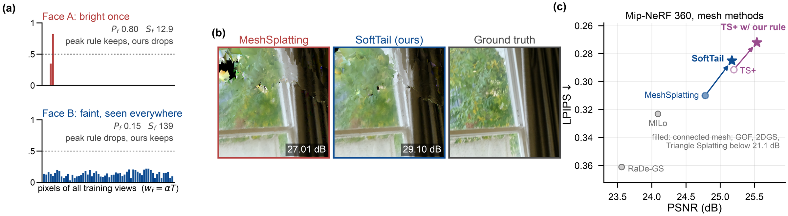
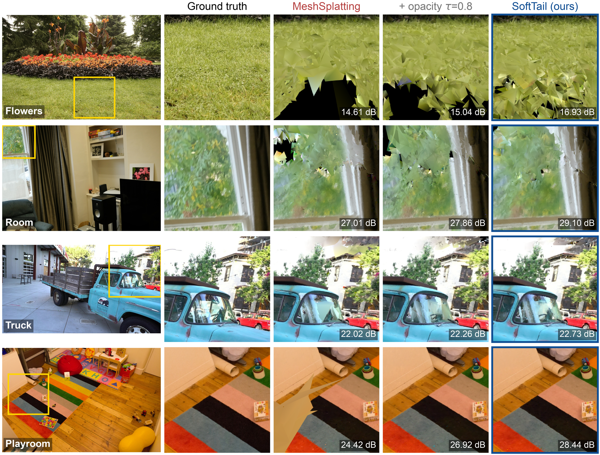
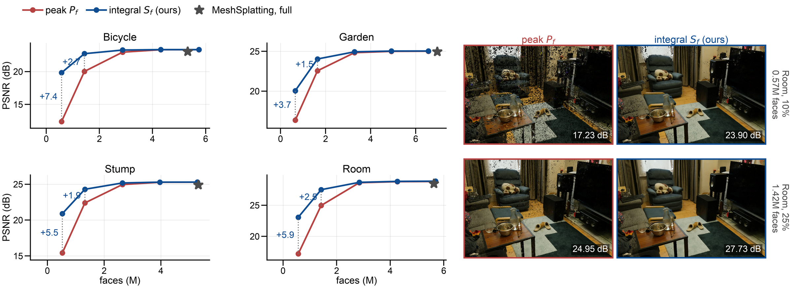
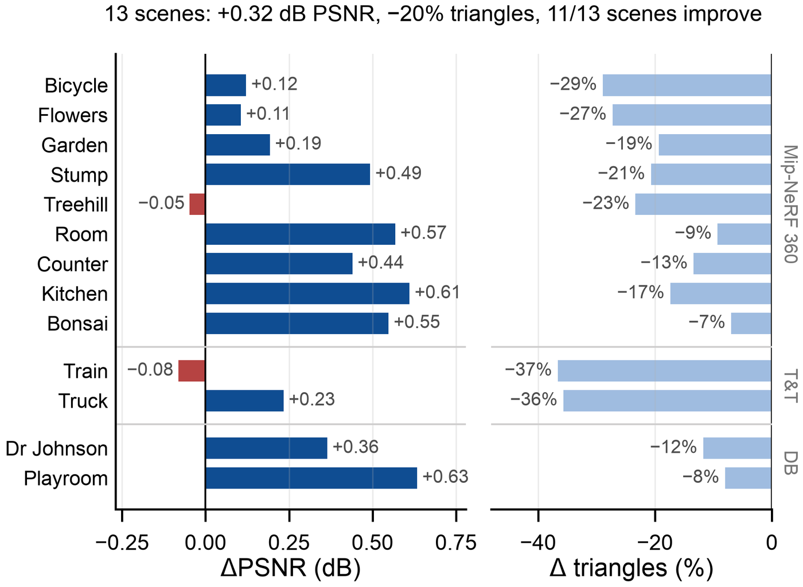
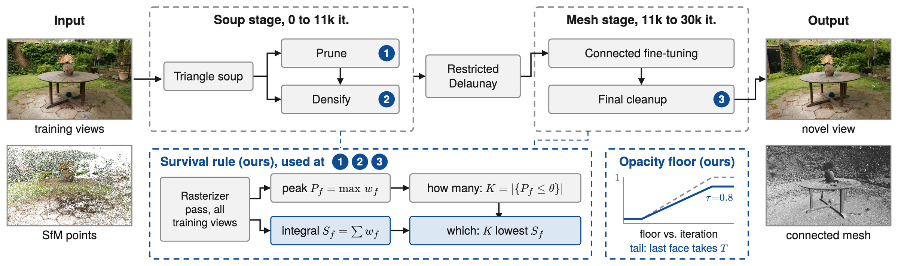
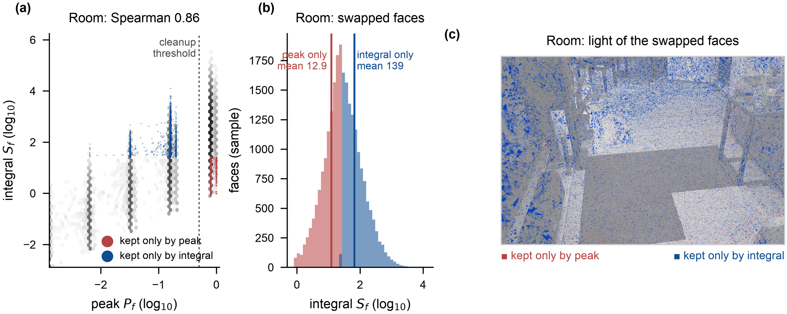

<h1 align="center">SoftTail</h1>

<p align="center">
  <strong>Contribution-aware triangle survival for mesh splatting</strong><br>
  <em>Which triangles should survive when the budget is fixed?</em>
</p>

<p align="center">
  <a href="#installation"></a>
  <a href="#installation"></a>
  <a href="#installation"></a>
  <a href="LICENSE.md"></a>
  <a href="#data-checkpoints-and-results"></a>
</p>

<p align="center">
  <a href="#news">News</a> ·
  <a href="#results">Results</a> ·
  <a href="#method">Method</a> ·
  <a href="#installation">Install</a> ·
  <a href="#data-checkpoints-and-results">Data &amp; checkpoints</a> ·
  <a href="#quick-start-score-a-released-checkpoint-in-5-minutes">Quick start</a> ·
  <a href="#reproduce-the-paper-step-by-step">Reproduce</a> ·
  <a href="integrations/triangle_splatting_plus">Triangle Splatting+</a>
</p>

<p align="center">
  
</p>

Triangle splatting fits a scene with a **fixed budget of triangles**, and
MeshSplatting turns them into **one connected mesh**. With the budget fixed,
quality depends on *which* triangles survive pruning, densification and the
final cleanup. Every current method keeps a triangle if its **peak** blending
weight `max α·T` is high. SoftTail keeps the published schedule and the number
of triangles removed at every step, but picks them by **integrated
contribution** `S_f = Σ α·T`, and stops the opacity schedule at `0.8` with a
lossless compositing tail. The rasterizer gains one `atomicAdd`.

## News

- **2026-10** — Compact meshes (10–75% of the face budget), the survival rule
  inside **Triangle Splatting+** ([patch](integrations/triangle_splatting_plus)),
  per-face light maps and object extraction. New figures and result JSONs.
- **2026-09** — Code, launchers, per-view results for all 13 scenes, ablations
  and 13 checkpoints released.

## Highlights

| | |
|---|---|
| **All 13 scenes improve** | +0.37 / +0.40 / +0.64 dB PSNR over MeshSplatting on Mip-NeRF 360 / Tanks & Temples / Deep Blending; best connected-mesh method on Mip-NeRF 360, best SSIM and LPIPS of all mesh methods there |
| **Not capacity** | cut back to the control's exact face count, 9/9 scenes keep +0.19 of the +0.21 dB gain; re-picking the same number of faces at random costs −1.82 dB |
| **Small budgets** | same trained mesh, same face count: **+3.7 to +7.4 dB** at 10% of the faces, +1.5 to +2.7 dB at 25%; at 50% it matches the full-size MeshSplatting mesh |
| **Transfers** | inside Triangle Splatting+, the rule alone gives **+0.32 dB with 20% fewer triangles** over 13 scenes (25.54 dB on Mip-NeRF 360) |
| **Cheap** | one float per triangle, one `atomicAdd`; no network, no new hyperparameter |
| **Auditable** | every number is a JSON in [`results/formal/`](results/formal), hashed in [`results/SHA256SUMS`](results/SHA256SUMS); the paper tables are generated from them |

## Results

<p align="center">
  
</p>

### Comparison with mesh-based methods

Other methods as reported by MeshSplatting and Triangle Splatting+; ours from
the frozen evaluator. *Connected*: one indexed mesh with shared vertices.

| Method | Connected | M360 PSNR ↑ | M360 SSIM ↑ | M360 LPIPS ↓ | T&T PSNR ↑ | T&T SSIM ↑ | T&T LPIPS ↓ |
|---|:---:|---:|---:|---:|---:|---:|---:|
| 2DGS (mesh) | ✓ | 15.36 | 0.498 | 0.474 | 14.23 | 0.569 | 0.485 |
| GOF (mesh) | ✓ | 20.78 | 0.573 | 0.465 | **21.69** | 0.690 | 0.326 |
| RaDe-GS (mesh) | ✓ | 23.56 | 0.668 | 0.361 | 20.51 | 0.659 | 0.344 |
| MILo | ✓ | 24.09 | 0.688 | 0.323 | 21.46 | 0.706 | 0.348 |
| MeshSplatting | ✓ | 24.78 | 0.728 | 0.310 | 20.52 | 0.745 | 0.287 |
| Triangle Splatting+ | semi | **25.21** | 0.742 | 0.294 | 20.91 | 0.773 | **0.249** |
| **SoftTail (ours)** | ✓ | 25.17 | **0.748** | **0.285** | 21.06 | **0.778** | **0.249** |

### Against the reproduced baseline (same code, GPU, evaluator, test views)

| Benchmark | MeshSplatting | **SoftTail-Quality** | SoftTail-Speed | Δ PSNR | Scenes improved |
|---|---|---|---|---:|---:|
| Mip-NeRF 360 (9) | 24.80 / 0.732 / 0.308 | **25.17 / 0.748 / 0.285** | 25.12 / 0.746 / 0.286 | +0.37 | 9/9 |
| Tanks & Temples (2) | 20.66 / 0.759 / 0.276 | **21.06 / 0.778 / 0.249** | 21.05 / 0.776 / 0.251 | +0.40 | 2/2 |
| Deep Blending (2) | 27.09 / 0.842 / 0.335 | **27.73 / 0.854 / 0.315** | 27.71 / 0.853 / 0.317 | +0.64 | 2/2 |

Cells are PSNR / SSIM / LPIPS. Quality and Speed are the same checkpoint rendered
at 4× and 3× supersampling (15.4 and 18.6 FPS on Mip-NeRF 360, one A40).

### Compact meshes from the same model

<p align="center">
  
</p>

The saved pre-cleanup mesh is cut to 10/25/50/75% of the published budget, once
by the peak and once by `S_f`, with identical face counts per pair. The integral
wins all 16 pairs on PSNR, SSIM and LPIPS; numbers in
[`results/formal/softtail_compact_frontier.json`](results/formal/softtail_compact_frontier.json).

| PSNR (dB), peak → integral | 10% | 25% | 50% | 75% |
|---|---|---|---|---|
| Bicycle | 12.39 → **19.83** | 20.02 → **22.72** | 22.95 → **23.27** | 23.32 → **23.33** |
| Garden | 16.35 → **20.05** | 22.55 → **24.04** | 24.83 → **24.94** | 25.00 → **25.03** |
| Stump | 15.42 → **20.90** | 22.39 → **24.30** | 24.96 → **25.18** | 25.28 → **25.29** |
| Room | 17.19 → **23.07** | 24.96 → **27.50** | 28.62 → **28.68** | 28.79 → **28.83** |

### The rule inside Triangle Splatting+

<p align="center">
  
</p>

| Triangle Splatting+, both retrained | PSNR ↑ | SSIM ↑ | LPIPS ↓ | Triangles |
|---|---:|---:|---:|---:|
| Mip-NeRF 360, published rule | 25.20 | 0.750 | 0.291 | 1.29M |
| Mip-NeRF 360, **+ integrated survival** | **25.54** | **0.760** | **0.272** | **1.07M** |
| Tanks & Temples, published rule | 20.74 | 0.769 | 0.252 | 0.84M |
| Tanks & Temples, **+ integrated survival** | **20.81** | **0.771** | **0.241** | **0.54M** |
| Deep Blending, published rule | 27.88 | 0.858 | 0.317 | 1.58M |
| Deep Blending, **+ integrated survival** | **28.38** | **0.862** | **0.291** | **1.43M** |

Patch and launcher: [`integrations/triangle_splatting_plus/`](integrations/triangle_splatting_plus).

## Method

<p align="center">
  
</p>

MeshSplatting's pipeline is unchanged except at its three survival decisions —
① pruning, ② densification, ③ final cleanup — and its opacity schedule. At each
decision the published peak rule decides **how many** faces are removed
(`K = |{P_f ≤ θ}|`) and the integrated contribution decides **which**: the `K`
faces with the lowest `S_f` ([`sota/survival.py`](sota/survival.py)). The mesh
size therefore stays that of the baseline by construction. The opacity floor
stops at `τ = 0.8`, and at render time the last face on each ray takes the
residual transmittance, so no radiance is lost.

<p align="center">
  
</p>

On Room's 11.4M pre-cleanup faces the two rules agree on most faces
(Spearman 0.86) but **swap 12.2% of the survivors**. Faces only the peak keeps:
mean peak 0.80, mean `S_f` 12.9. Faces only the integral keeps: mean peak 0.15,
mean `S_f` **139**. Rendered per face (right panel), the light of the integral's
extra survivors covers the surfaces of the view; the peak rule's keeps light up
isolated specks.

### Ablation (Mip-NeRF 360, 9 scenes, published face budget in every row)

| Opacity τ | Training statistic | Cleanup statistic | PSNR ↑ | SSIM ↑ | LPIPS ↓ | Δ |
|---|---|---|---:|---:|---:|---:|
| 1 (MeshSplatting) | peak | peak | 24.80 | 0.732 | 0.308 | — |
| 0.8 | peak | peak | 24.96 | 0.739 | 0.301 | +0.16 |
| 0.8 | **integral** | peak | 25.12 | 0.746 | 0.288 | +0.16 (9/9) |
| 0.8 | **integral** | **integral** | **25.17** | **0.748** | **0.285** | +0.21 (9/9) |
| 0.8, cut to the size of row 2 | integral | integral | 25.15 | 0.748 | 0.285 | +0.19 (9/9) |
| 0.8 (Bicycle, Garden, Room) | peak | **random** | 23.79 | 0.693 | 0.333 | −1.82 |

## Installation

Tested with Python 3.11, PyTorch 2.7.1, CUDA 12.6 on NVIDIA A40 and RTX 4090 D.

```bash
git clone https://github.com/ChizkiyahuOhayon/SoftTail.git
cd SoftTail

conda create -n softtail python=3.11 -y          # or micromamba
conda activate softtail
conda install -c "nvidia/label/cuda-12.6.0" cuda -y

pip install torch==2.7.1 torchvision==0.22.1
pip install -r requirements.txt
bash compile.sh                                    # the rasterizer with the S_f accumulator
pip install ./submodules/simple-knn --no-build-isolation
pip install ./submodules/effrdel --no-build-isolation

python -m unittest tests.test_integrated_importance -v   # rule tests, no GPU needed
```

Every launcher sources [`sota/ensure_environment.sh`](sota/ensure_environment.sh),
which checks that PyTorch and NVCC agree on CUDA and rebuilds the rasterizer when
its source changes.

## Data, checkpoints and results

Everything a user needs, where it lives, and how to use it:

| What | Where | Size | How to use |
|---|---|---:|---|
| Mip-NeRF 360 images | [official page](https://jonbarron.info/mipnerf360/) (both parts) | — | unpack to `data/mipnerf360/<scene>/{images_2,images_4,sparse/0}` |
| Tanks & Temples (train, truck) | [3DGS preprocessed release `tandt_db.zip`](https://repo-sam.inria.fr/fungraph/3d-gaussian-splatting/datasets/input/tandt_db.zip) · [licence](https://www.tanksandtemples.org/license/) | — | unpack `tandt/` to `data/tandt/<scene>/{images,sparse/0}` |
| Deep Blending (drjohnson, playroom) | same zip as above (`db/`) · [authors](https://github.com/Phog/DeepBlending#usage) | — | unpack `db/` to `data/db/<scene>/{images,sparse/0}` |
| **13 SoftTail checkpoints** | [Google Drive · `checkpoints/`](https://drive.google.com/drive/folders/1ArvrfosxI99JwkMrYw6V6RnOxs3eL2RD) | 0.4–0.8 GB each, 8.9 GB total | `tar xf softtail_<scene>.tar`, then [quick start](#quick-start-score-a-released-checkpoint-in-5-minutes) |
| Checkpoint hashes | [Google Drive · `checkpoints/SHA256SUMS`](https://drive.google.com/drive/folders/1ArvrfosxI99JwkMrYw6V6RnOxs3eL2RD) | 1 KB | `shasum -a 256 -c SHA256SUMS` |
| All result JSONs (per view, per scene, per arm) | [`results/formal/`](results/formal) in this repo | 2 MB | verify with `shasum -a 256 -c results/SHA256SUMS`; tables via `python results/make_tables.py` |
| Triangle Splatting+ patch | [`integrations/triangle_splatting_plus/`](integrations/triangle_splatting_plus) | 20 KB | `git am` onto the pinned commits |

The Drive bundle root is
[SoftTail release](https://drive.google.com/drive/folders/1Gj7ykZadiJ2IuTUrN046vAEGZMSnA_PY).
Raw datasets are not redistributed. The MeshSplatting baseline, the compact cuts
and the Triangle Splatting+ models are regenerated by the launchers below.

Each checkpoint archive unpacks to

```text
softtail_<scene>/
├── cfg_args
├── cameras.json
└── point_cloud/iteration_30000/point_cloud_state_dict.pt   # the final connected mesh
```

## Quick start: score a released checkpoint in 5 minutes

```bash
# 1. data and checkpoint
tar xf softtail_garden.tar -C models/

# 2. score it exactly as in the paper (SoftTail-Quality)
python -m sota.main_table_eval -s data/mipnerf360/garden -i images_4 --eval \
  -m models/softtail_garden --iteration 30000 \
  --scene garden --arm ours_quality --output eval/garden_quality

# expected: PSNR 25.05, SSIM 0.779, LPIPS 0.199  (results/formal/softtail_nine_scene_main_table.json)

# 3. export the connected mesh as a .ply
python create_ply.py models/softtail_garden/point_cloud/iteration_30000 --out garden_mesh.ply
```

The evaluator fixes the deployment settings per arm:

| Arm | Opacity floor | Supersampling | Tail cutoff | Absorb tail |
|---|---:|---:|---:|:---:|
| `stock` (MeshSplatting) | 0.9999 | 4× | 1e-4 | no |
| `ours_quality` | 0.8 | 4× | 1e-2 | yes |
| `ours_speed` | 0.8 | 3× | 1e-2 | yes |

## Reproduce the paper step by step

**Step 1 — train one scene** (~2 h on an A40; trains, re-runs the cleanup by `S_f`, scores both arms):

```bash
export CUDA_VISIBLE_DEVICES=0
bash scripts/run_scene.sh softtail data/mipnerf360 garden runs/
#  -> runs/softtail__garden/eval_quality/result.json   (SoftTail-Quality)
#  -> runs/softtail__garden/eval_speed/result.json     (SoftTail-Speed)
#  -> runs/softtail__garden/cut/survival.json          (how much the two rules disagree)
```

Under the hood: `train.py ... --final_opacity 0.8 --integrated_importance --save_precleanup`,
then `sota.survival_cleanup` (writes the peak cut `v1/` and the integral cut `oats/`
at the same face count), then `sota.main_table_eval`.

**Step 2 — the baseline and the ablation rows** on the same scene:

```bash
bash scripts/run_scene.sh meshsplatting data/mipnerf360 garden runs/   # row (a)
bash scripts/run_scene.sh opacity_floor data/mipnerf360 garden runs/   # row (b)
bash scripts/equal_budget.sh data/mipnerf360 garden runs/              # row (e)
```

**Step 3 — compact meshes** (minutes; no training):

```bash
bash scripts/compact.sh data/mipnerf360 garden runs/
#   10% of the budget, 656,325 faces: peak 16.35 dB, integral 20.05 dB (+3.70)
#   ...
```

**Step 4 — Triangle Splatting+** (~1 h per scene for both arms):

```bash
bash integrations/triangle_splatting_plus/run_tsplus.sh /path/to/triangle-splatting2 data garden runs/tsplus
#   garden: TS+ 25.157 -> 25.349 (+0.193 dB), ...
```

**Step 5 — whole benchmarks and the paper tables:**

| Goal | Command | GPU time |
|---|---|---:|
| Mip-NeRF 360: main table, ablation, equal budget | `bash scripts/reproduce.sh mipnerf360 data/mipnerf360 runs/m360` | ~60 h (A40) |
| Tanks & Temples | `bash scripts/reproduce.sh tandt data/tandt runs/tandt` | ~12 h |
| Deep Blending | `bash scripts/reproduce.sh deepblending data/db runs/db` | ~12 h |
| LaTeX tables from our archived JSONs | `python results/make_tables.py` | none |
| Figure renders (compact views, per-face light maps) | `python -m sota.figure_renders {compact,contrib} ...` (see its docstring) | minutes |

Every launcher is resumable. Compare your numbers with the per-scene rows in
[`results/formal/`](results/formal).

## Repository layout

```text
SoftTail/
├── train.py                       # MeshSplatting training + --final_opacity, --integrated_importance
├── scripts/                       # start here: run_scene, reproduce, equal_budget, compact, collect
├── sota/
│   ├── survival.py                # the budget-matched survival rule
│   ├── survival_cleanup.py        # offline final cleanup at any face budget (--budget)
│   ├── main_table_eval.py         # frozen evaluator (stock / ours_quality / ours_speed)
│   ├── survival_statistic.py      # peak vs. integral measurement
│   └── figure_renders.py          # compact-cut renders and exact per-face light maps
├── integrations/
│   └── triangle_splatting_plus/   # patch + launcher for Triangle Splatting+
├── submodules/                    # rasterizer with the S_f accumulator, simple-knn, rdel
├── results/formal/                # archived result JSONs + SHA-256 manifest
└── docs/REPRODUCIBILITY.md        # protocol, dataset layout, result-to-code map
```

## Citation

```bibtex
@misc{softtail2026,
  title  = {SoftTail: Contribution-Aware Triangle Survival for Mesh Splatting},
  author = {Liu, Zhao},
  year   = {2026},
  note   = {Code: https://github.com/ChizkiyahuOhayon/SoftTail}
}
```

## Acknowledgements and licence

SoftTail is built on the official
[MeshSplatting](https://github.com/meshsplatting/mesh-splatting) implementation,
which builds on 3D Gaussian Splatting; the integration targets
[Triangle Splatting+](https://github.com/trianglesplatting2/triangle-splatting2).
We thank their authors for releasing their code. Please cite MeshSplatting when
using this repository, and see [`LICENSE.md`](LICENSE.md) and
[`LICENSE_GS.md`](LICENSE_GS.md) for the applicable terms.
